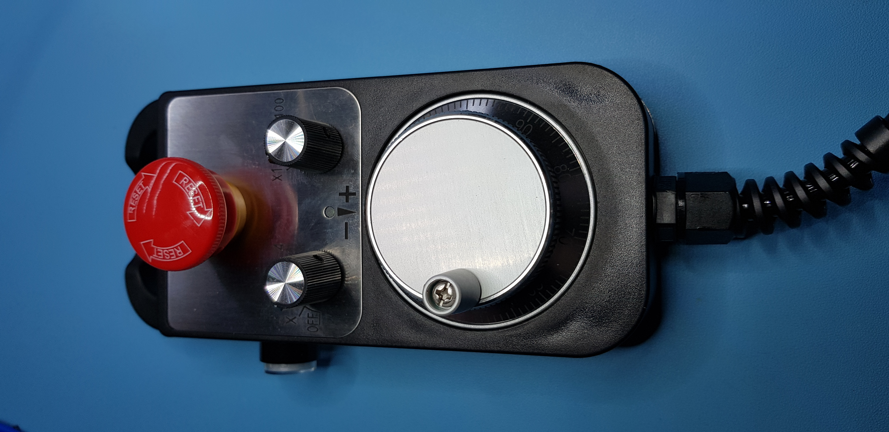
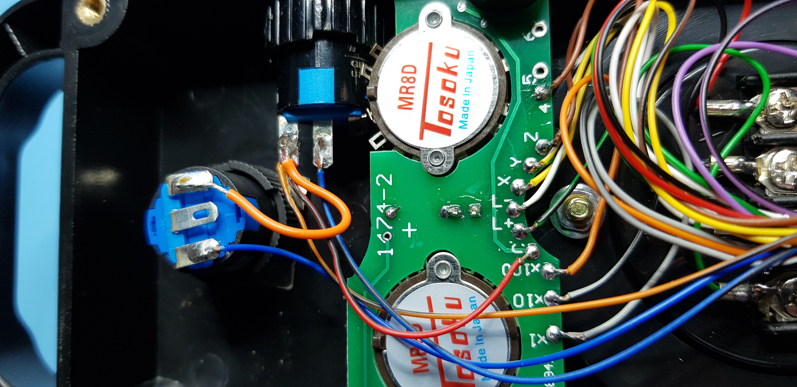

# MPG-Nano
Firmware and UCCNC macro for Arduino Nano based serial-over-USB interface for modified 4-axis Chinese MPG pendant.

# Functions
The pendant LED flashes slowly when the axis select switch is in any position other than 'Off'. The step size select switch selects between step sizes of 1 micron/step, 10 microns/step and 100 microns/step. The pendant's side switch selects 1mm/step 'rapid mode' when pressed (if wiring modification documented below has been made). The pendant's LED flashes fast when 1mm/step is selected. The Arduino Nano's User LED flashes continuously to indicate that the firmware is running.

## Compiling & Programming
To build the firmware, this project requires avr-gcc, avr-libc and avrdude to be correctly installed on a host PC. Type `make program` to program the Nano (the Makefile for this project assumes that an AVR-ISP MkII programmer is being used).

The Makefile has only been tested in a Linux development environment. It may need modification to work in Windows/OS X.

## Side Button Modification
The firmware supports an optional modification to the pendant's internal wiring such that the side button acts as a x1000 'rapid mode' selector instead of a pendant enable button.

Modifications to the pendant's internal wiring are as follows:

1. Identify red wire linking side button to internal PCB. Unsolder wire from button.
2. Unsolder blue/black wire from E-Stop button.
3. Solder red wire (unsoldered in Step 1) to same pin as orange/black wire, on side button.
4. Solder blue/black wire (unsoldred in Step 2) to side button pin where red wire was originally soldered.
5. Add link between side button pin, where orange/black wire is soldred, and E-Stop button pin where blue/black wire was originally soldered.

## Connections to Arduino Nano
Assuming that the pendant has had its wiring modified to support 'rapid mode', it must be connected to the Arduino Nano's pins as follows:

| Wire Color   | Arduino Pin | Description   |
|--------------|-------------|---------------|
| Orange/Black | GND         | Switch Common |
| Gray         | D2          | x1 Select     |
| Gray/Black   | D3          | x10 Select    |
| Orange       | D4          | x100 Select   |
| Green/Black  | D5          | LED+          |
| Blue         | D6          | E-Stop        |
| Blue/Black   | D7          | Rapid Select  |
| Brown        | D8          | Z Select      |
| Brown/Black  | D9          | 4 Select      |
| Green        | A0          | Encoder A+    |
| Violet       | A1          | Encoder A-    |
| White        | A2          | Encoder B+    |
| Violet/Black | A3          | Encoder B-    |
| Yellow       | A4          | X Select      |
| Yellow/Black | A5          | Y Select      |
| Red          | +5V         | Encoder +5V   |
| Black        | GND         | Encoder GND   |
| White/Black  | GND         | LED-          |

If the pendant has not been modified then the Blue/Black wire must be connected to GND.

In the author's implementation, the pendant cable was terminated with a 25-pin D-Type connector which mated with a connector mounted on a metal enclosure housing the Nano.

## TODO
Develop and document UCCNC macro loop.
